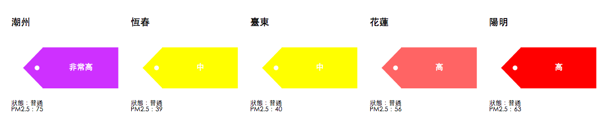

# react-d3-mobile-card

react-d3 mobile card data visualization.

## Quick example

### Ordinal Card (you can use pictures as ordinal scale)


```js
"use strict";

var React = require('react');
var ReactDOM = require('react-dom');

var OrdinalCard = require('react-d3-mobile-card').OrdinalCard;

// Example
(function() {
  var width = 300;
  var height = 400;
  var data = require('json!../data/air.json');
  var title = function(d) { return d.SiteName; }
  var value = function(d) { return d.Status; }
  var note = function(d) {
    return '<div>狀態：' + d.Status + '</div><div>PM2.5：' + d['PM2.5'] + '</div>';
  }

  var cards = data.map(function(d, i) {
    return (
      <OrdinalCard
        key= {i}
        data= {d}
        width= {width}
        height= {height}
        title= {title}
        value= {value}
        note= {note}
        ordinalRange= {['./img/PSI-1.png', './img/PSI-2.png']}
        ordinalDomain= {['良好', '普通']}
        titleClass= {"title-test-class"}
        ordinalClass= {"ordinal-test-class"}
        noteClass= {"note-test-class"}
      />
    )
  })


  ReactDOM.render(
    <div>
      {cards}
    </div>
  , document.getElementById('blank-ordinal')
  )
})()
```

### Donut Card


```js
"use strict";

var React = require('react');
var ReactDOM = require('react-dom');

var RatioCard = require('../../lib/index').RatioCard;

// Example
(function() {
  var width = 300;
  var height = 400;
  var data = require('json!../data/water.json');
  var title = function(d) { return d.name; }
  var max = function(d) {return 100; };
  var value = function(d) { return d.percentage; }
  var note = function(d) {
    return '<div><b>更新時間：' + d.updateAt + '</b></div>'
    + '有效蓄水量：' + d.volumn;
  }

  var cards= [];

  for(var key in data) {
    cards.push(
      <RatioCard
        key= {key}
        data= {data[key]}
        width= {width}
        height= {height}
        title= {title}
        max= {max}
        value= {value}
        note= {note}
        colorRange= {['rgb(26,152,80)', 'rgb(165,0,38)']}
        titleClass= {"title-test-class"}
        donutClass= {"donut-test-class"}
        noteClass= {"note-test-class"}
      />
    )
  }


  ReactDOM.render(
    <div>
      {cards}
    </div>
  , document.getElementById('blank-water')
  )
})()

```


### Tag Card



```js
<TagCard
  key= {i}
  data= {d}
  width= {width}
  height= {height}
  title= {titleSet}
  margins= {{left: 30, bottom: 30, right: 30, top: 30}}
  value= {text}
  color= {color}
  note= {noteSet}
/>
```

## License

Apache 2.0
